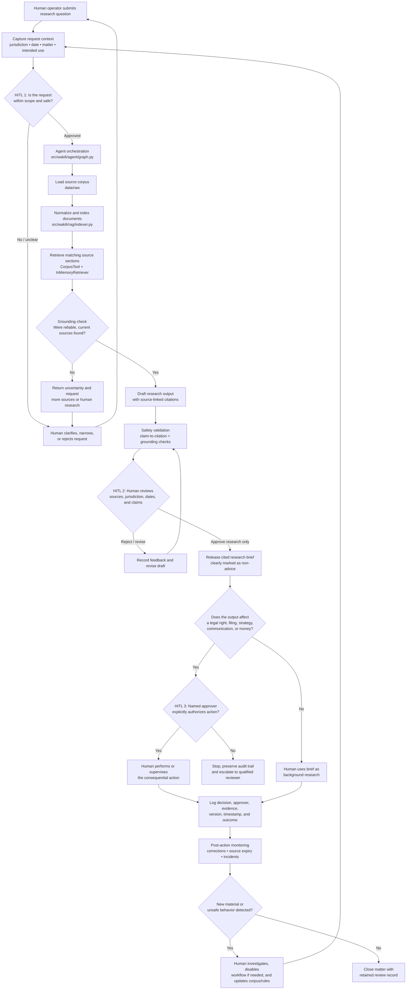

# mini-wakili-agent

A modular Python scaffold for a grounded legal research agent. The repository separates orchestration, retrieval, and legal-AI safety concerns so each layer can be tested and replaced independently.

## Setup

```bash
python -m venv .venv
source .venv/bin/activate
pip install -r requirements.txt
```

Copy `.env.example` to `.env` and add provider credentials only when connecting a real model or search service.

## Run

```bash
PYTHONPATH=src python -m wakili.main "What documents are available?"
```

The default CLI runs locally without external services and reports the current corpus state.

## Test

```bash
PYTHONPATH=src python -m pytest
```

See [DESIGN.md](DESIGN.md) for architecture decisions and safety boundaries.

## Layout

- `src/wakili/agent`: orchestration and research tools
- `src/wakili/rag`: document chunking and retrieval
- `src/wakili/safety`: citation and grounding checks
- `data/raw`: source documents
- `data/index`: generated local indexes, ignored by Git
- `tests`: focused unit tests

This scaffold intentionally does not provide legal advice; it is infrastructure for building a cited research workflow.

## Model benchmark

A1–D written interview answers are intentionally omitted. The executable model benchmark covers deterministic retrieval, chunk-level evidence, citation support, refusal behavior, PII detection, contract-risk flags, and HITL enforcement. Run `PYTHONPATH=src python mini_wakili.py` for the aggregate score and `PYTHONPATH=src python -m pytest -q` for the full test suite; the model target is an aggregate score of at least 85%.

## End-to-end architecture with human-in-the-loop controls

The system is designed as a **decision-support workflow**, not an autonomous legal decision-maker. The model may retrieve, summarize, and propose options, but it must not decide legal strategy, make a filing, contact an authority, or deliver a consequential recommendation without an identified human operator reviewing and approving the relevant checkpoint.



### Required human approval gates

- **Intake gate:** a human confirms the purpose, jurisdiction, time period, requester, and whether the task is appropriate for the system.
- **Evidence gate:** a human checks that retrieved sources are authoritative, current, relevant, and sufficient before relying on the draft.
- **Action gate:** a named human approver must authorize any recommendation or output that could change rights, obligations, legal strategy, filings, external communications, or financial position.
- **Audit gate:** every approval, rejection, revision, source set, model output, and final action is recorded so the decision can be reconstructed.

A failed check must be a **stop condition**, not a signal for the model to guess. In production, the HITL gates should be implemented as explicit workflow states with authenticated reviewers, least-privilege permissions, immutable audit events, and clear escalation paths.
